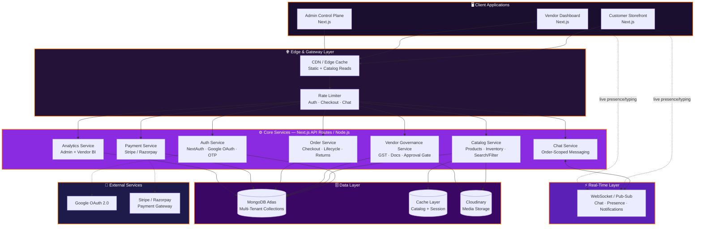
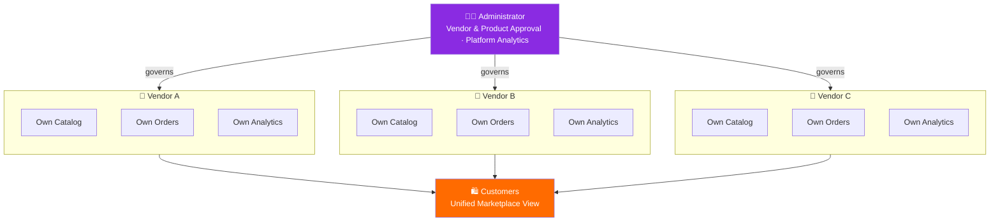
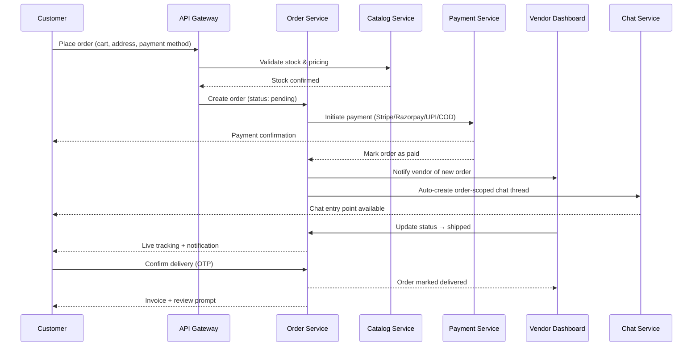

<p align="center">
  
</p>

<p align="center">
  <b>Enterprise Multi-Vendor E-Commerce SaaS Platform</b>
</p>

<p align="center">
  
  
  
  
  
  
  
  
</p>

<p align="center">
  
  
  
  
  
  
</p>

<p align="center">
  <a href="#-executive-summary">Executive Summary</a> •
  <a href="#-system-architecture">Architecture</a> •
  <a href="#-role-based-modules">Modules</a> •
  <a href="#-real-time-chat-system">Chat System</a> •
  <a href="#-security--compliance">Security</a> •
  <a href="#-production-readiness">Production Readiness</a> •
  <a href="#-tech-stack">Tech Stack</a> •
  <a href="#-scalability-strategy">Scalability</a> •
  <a href="#-roadmap">Roadmap</a> •
  <a href="#-author">Author</a>
</p>

---

## 🧭 Executive Summary

**CartSphere** is an enterprise-grade **multi-vendor e-commerce SaaS platform** — a single cloud-based marketplace where independent companies register, launch fully-managed storefronts, and sell products side by side, comparable in scope to Flipkart, Amazon, or Etsy's seller ecosystem.

Rather than a single-store shopping cart, CartSphere is architected as a **multi-tenant marketplace operating system**: every vendor operates an isolated business unit — its own catalog, inventory, orders, and analytics — while a central administrative layer governs onboarding, compliance, and platform-wide financial oversight.

| Pillar | What It Means Here |
|---|---|
| 🏢 **Multi-Tenancy** | Each vendor is a fully isolated business entity with independent data, branding, and operations |
| 🛡️ **Governance & Compliance** | GST verification, document review, and product-level approval gates before anything goes live |
| 📊 **Real-Time Business Intelligence** | Live revenue, order, and performance analytics across admin and vendor roles |
| 💬 **Integrated Communication** | Order-linked, real-time chat connecting customers, vendors, and support |
| 🏭 **Production Discipline** | Environment separation, observability, and rollback-safe deployments — not a demo build |

---

## 🏗️ System Architecture

CartSphere is built around **three role-scoped dashboards** — Administrator, Vendor, and Customer — sharing a common core (auth, catalog, orders, payments) while enforcing strict data and permission boundaries between tenants. The system is structured today as a **modular monolith** with clear service boundaries, deliberately designed so each boundary can be extracted into an independent service without a rewrite.



### Multi-Tenant Data Model



### Order & Checkout — Sequence Flow



### Architectural Principles

- **Tenant isolation** — every vendor's catalog, orders, and revenue data are logically partitioned at the schema level, preventing cross-vendor data leakage
- **Approval-gated publishing** — no vendor or product reaches the marketplace without passing an explicit administrative checkpoint
- **Composable dashboards** — Admin, Vendor, and Customer experiences are built on shared primitives (auth, analytics, chat) but rendered as distinct, role-specific applications
- **API-first backend** — Next.js API routes expose a consistent contract consumed by all three dashboards, keeping business logic centralized
- **Modular monolith, not a ball of mud** — service boundaries (Catalog, Orders, Vendor Governance, Payments, Chat, Analytics) are enforced in code today, so they can be lifted into independent services without redesigning the data model

---

## ⚙️ Role-Based Modules

### 👨‍💼 Administrator — Marketplace Control Plane

**Vendor Governance**
- Approve / reject vendor registrations
- GST number & business document verification
- Suspend or block non-compliant vendors
- Manage vendor subscription tiers

**Product Approval Pipeline**
- Every product requires admin sign-off before going live
- Review images, pricing, and listing details
- Approve, reject-with-reason, or disable at any time

**Platform Intelligence Dashboard**
- Daily / Monthly / Yearly revenue
- Order funnel: total, pending, delivered, cancelled, returned
- Best-selling & top-rated products
- Top-performing vendors and revenue-by-vendor breakdown
- Sales trend graphs and order analytics

---

### 🏪 Vendor — Independent Store Operations

Each vendor operates a self-contained business dashboard:

| Category | Capabilities |
|---|---|
| Identity | Company profile, GST details, store logo & banner |
| Catalog | Product management, inventory management, stock monitoring |
| Orders | Order management, cancellations, returns |
| Growth | Sales analytics, revenue dashboard, coupon management |
| Reputation | Customer reviews & product ratings |

**Product Analytics** — daily / weekly / monthly sales, product-level revenue, best sellers, low-stock alerts, cancelled & returned order tracking.

**Delivery Configuration** — vendors independently control Cash-on-Delivery availability, delivery charges, free-delivery thresholds, estimated delivery windows, and serviceable locations.

---

### 🛍️ Customer — Unified Shopping Experience

**Authentication:** Email login, Google login, OTP verification.

**Discovery & Shopping:** Category/brand/price filtering, wishlist, cart, secure checkout.

**Orders:** Live tracking, pre-delivery OTP verification, real-time status updates, invoice download, full order history.

**Returns & Cancellations:** Order cancellation, return requests under a **7-day return policy**, refund and return-status tracking.

**Reviews & Ratings:** Post-delivery product and vendor ratings, written reviews, and image uploads — surfaced on both the product page and the vendor's dashboard.

---

## 🔍 Smart Product Discovery

A unified, instant filtering engine spans the entire multi-vendor catalog:

`Category` · `Brand` · `Vendor` · `Price Range` · `Rating` · `Discount` · `Availability` · `New Arrivals` · `Best Sellers` · `Popular Products`

---

## 💳 Payments & Delivery

| Payments | Delivery |
|---|---|
| Credit / Debit Cards | OTP verification before delivery |
| UPI | Live order tracking |
| Net Banking | Delivery notifications |
| Wallets | Delivery charge calculation |
| Cash on Delivery *(vendor-configurable)* | Free shipping rules & estimated delivery date |

---

## 💬 Real-Time Chat System

CartSphere ships with a **first-class, order-linked messaging layer** connecting customers, vendors, and admins — not a bolted-on support widget.

- Customers get a chat entry point automatically upon placing an order, scoped to that vendor and order
- Vendors respond in real time to product questions, delivery updates, and return/replacement discussions
- Admins can monitor conversations to resolve disputes and enforce marketplace policy

### Chat Capabilities

| Feature | Description |
|---|---|
| 💬 Real-Time Messaging | Instant Customer ↔ Vendor communication |
| 👨‍💼 Admin Oversight | Conversation monitoring for dispute resolution |
| 🟢 Presence | Online / offline status indicators |
| ✍️ Typing Indicators | Live typing feedback |
| ✅ Delivery & Read Receipts | Message-level confirmation |
| 🖼️ Media Sharing | Image and file attachments |
| 📦 Order-Scoped Threads | Conversations tied to specific orders |
| 🔔 Real-Time Notifications | Instant alerts on new messages |
| 📱 Responsive UI | Fully mobile-optimized chat interface |
| 🔒 Secure Transport | Encrypted communication channel |
| 🕒 Persistent History | Complete, searchable chat history |
| 🚫 Moderation | Block and report users |

---

## 🔐 Security & Compliance

CartSphere applies a **defense-in-depth** posture — no single control is trusted in isolation.

| Layer | Control | Purpose |
|---|---|---|
| Authentication | Auth.js (NextAuth), Google OAuth, Email login, OTP verification | Multi-path, phishing-resistant identity |
| Vendor Onboarding | Mandatory GST verification & business document review | Filters out non-compliant sellers before listing |
| Publishing Integrity | Admin approval gate on every vendor and every product | Prevents unreviewed listings from reaching customers |
| Order Integrity | OTP verification prior to delivery confirmation | Confirms the right party received the order |
| Communication | Encrypted, order-scoped chat with block/report controls | Contains abuse to a reportable, auditable thread |
| Data Isolation | Per-vendor data partitioning across catalog, orders, and analytics | Prevents cross-tenant data leakage |
| Transport | HTTPS-only, secure cookie flags on session tokens | Prevents session interception |
| Secrets | Environment-scoped secrets, never committed to source | Prevents credential leakage via the repo |

---

## 📊 Real-Time Analytics

Both Admin and Vendor dashboards are powered by live data — revenue, order flow, product performance, and customer sentiment — rendered through interactive charts, enabling data-driven decisions across the marketplace without manual report generation.

---

## 🏭 Production Readiness

CartSphere is engineered against production standards, not tutorial standards. This section documents the operational discipline around the feature set above.

| Area | Practice |
|---|---|
| 🌍 **Environments** | Isolated `development` / `staging` / `production` configs — no shared secrets or databases across environments |
| 🚀 **Deployments** | Vercel Git-integrated deployments — every PR gets a preview deployment before merging to `main` |
| 🔁 **Rollback Safety** | Atomic deployments via Vercel — instant rollback to any previous build if an incident occurs |
| 🩺 **Health & Uptime** | Uptime monitoring on critical endpoints (auth, checkout, payments) |
| 🧯 **Error Tracking** | Structured error logging on API routes; payment and order failures are the highest-priority alert class |
| 🗃️ **Data Backups** | MongoDB Atlas automated daily backups with point-in-time recovery |
| 🔐 **Secrets Management** | Environment variables managed via Vercel's encrypted secret store, never hardcoded |
| 📉 **Rate Limiting** | Applied to auth, checkout, and chat endpoints to prevent abuse and accidental self-inflicted load |
| 🧪 **Pre-Merge Checks** | Type-checking (TypeScript) and linting enforced before merge |

> **Note:** This section reflects the intended production posture for a platform of this scope. If any specific practice (e.g., a particular monitoring tool, CI provider, or test coverage target) isn't yet wired up in your actual deployment, treat this table as the target checklist rather than a claim — update it to match what's genuinely running before publishing externally.

---

## 🛠 Tech Stack

| Layer | Technologies |
|---|---|
| **Frontend** | Next.js, React.js, TypeScript, Tailwind CSS, Shadcn UI |
| **Backend** | Node.js, Next.js API Routes |
| **Database** | MongoDB Atlas, Mongoose |
| **Authentication** | Auth.js (NextAuth), Google OAuth, Email Login |
| **Cloud Storage** | Cloudinary |
| **Payments** | Stripe / Razorpay |
| **Deployment** | Vercel, MongoDB Atlas, Cloudinary |

---

## 📈 Scalability Strategy

```
Current:   Multi-tenant modular monolith on Next.js API Routes  →  MongoDB Atlas (managed, sharding-ready)
Next:      Per-domain service extraction (Catalog / Orders / Chat / Payments / Analytics)
Future:    Dedicated realtime service for chat (WebSocket/Redis pub-sub)  →  Edge caching for catalog reads  →  Event-driven order pipeline
```

- **MongoDB Atlas** provides managed scaling, replication, and sharding as vendor/catalog volume grows
- **Cloudinary** offloads media storage and transformation from application servers
- **Role-scoped API contracts** allow Admin, Vendor, and Customer surfaces to scale and deploy independently in the future
- **Order-scoped chat threads** are structured to migrate cleanly to a dedicated real-time messaging service under high concurrency
- **Catalog reads** are the highest-traffic, lowest-mutation path — first candidate for edge/CDN caching as traffic grows

---

## 🌟 Why CartSphere?

CartSphere delivers an enterprise-level marketplace experience by combining multi-vendor management, GST verification, administrator-controlled product approvals, real-time analytics, intelligent product discovery, secure multi-method payments, OTP-based delivery verification, vendor-configurable shipping, and a full reviews-and-returns lifecycle — all on a scalable, role-secured, cloud-native foundation built for running multiple independent businesses on one platform.

---

## 🚀 Roadmap

- [ ] AI-driven product recommendations
- [ ] Vendor subscription tiering with usage-based billing
- [ ] Advanced fraud & anomaly detection for orders and reviews
- [ ] Dedicated real-time messaging microservice (WebSocket/Redis)
- [ ] Multi-currency & multi-region marketplace support
- [ ] Vendor-facing API for external inventory sync
- [ ] Full CI/CD pipeline with automated integration tests
- [ ] Kubernetes-based service extraction for Catalog & Orders

---

## 👨‍💻 Author

<p align="center">
  
</p>

<p align="center">
  
  
</p>

### **Biswajit Pattanaik**
**Full-Stack Developer • System Design Engineer • AI Integration • Backend Engineering • UI/UX Designer • DevOps & Deployment Engineer**

Designed, engineered, and deployed the **entire CartSphere platform** end-to-end — multi-tenant architecture, backend services, role-based dashboards, real-time chat system, and production infrastructure — as a single-owner, production-grade build

<a href="https://github.com/Biswajitpa"></a>

<p align="center">
  
</p>
